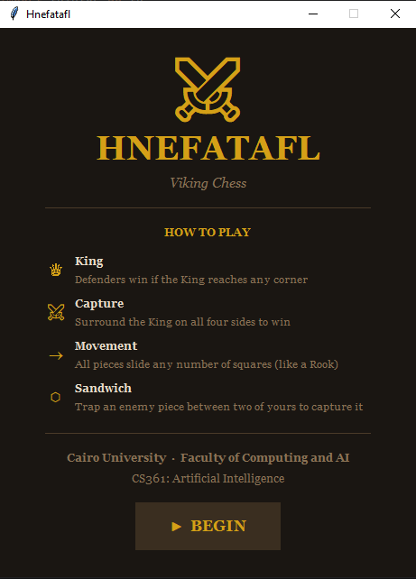
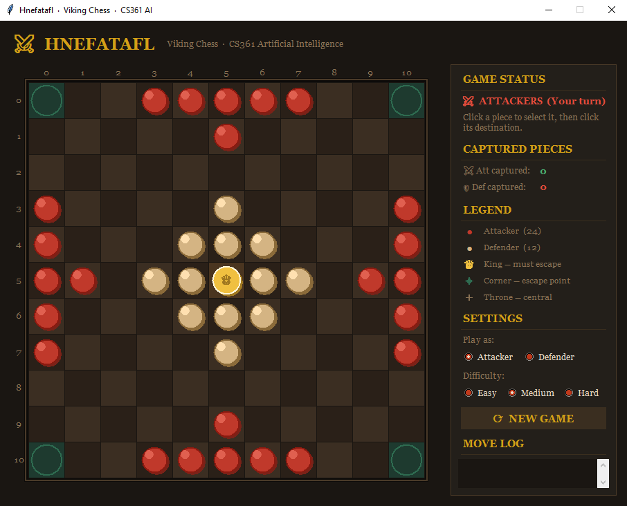
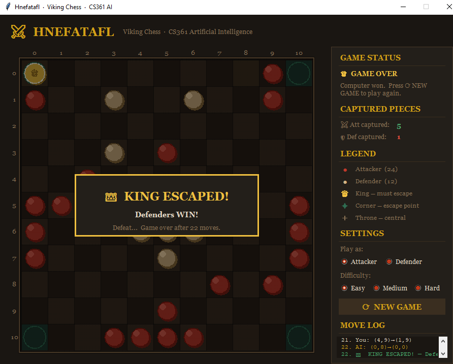

# Hnefatafl — Viking Chess

<p align="left">
  
  
  
  
</p>

A fully playable implementation of **Hnefatafl** (Viking Chess), an asymmetric two-player strategy board game originating from medieval Scandinavia. The game features a complete rule engine, a graphical interface built with Tkinter, and an AI opponent powered by the **alpha-beta pruning** algorithm with three selectable difficulty levels.

---

## Table of Contents

- [Game Overview](#game-overview)
- [Rules](#rules)
- [Project Architecture](#project-architecture)
- [Repository Structure](#repository-structure)
- [AI — How It Works](#ai--how-it-works)
- [Utility Function](#utility-function)
- [Difficulty Levels](#difficulty-levels)
- [Graphical Interface](#graphical-interface)
- [How to Run](#how-to-run)
- [Testing](#testing)
- [Technologies Used](#technologies-used)
- [Contributors](#contributors)

---

## Game Overview

Hnefatafl is a two-player **asymmetric** strategy game — meaning the two sides have different pieces, different starting positions, and completely different goals. It is played on an **11×11 board**.

| Side | Pieces | Goal |
|------|--------|------|
| Defenders (White) | 12 soldiers + 1 King | Escort the King to any corner square |
| Attackers (Black) | 24 soldiers | Surround and capture the King |

The asymmetry creates a fundamentally different experience from games like chess — both players are always working toward opposite objectives rather than mirrored ones.

---

## Screenshots

| Splash Screen | Gameplay | Game Over |
|---|---|---|
|  |  |  |


## Rules

### Board Layout
- The board is an **11×11 grid**
- The **Throne** is the center square at position (5, 5) — the King's starting position
- The four **corner squares** are the King's escape targets
- 12 Defenders are placed in a cross formation around the King
- 24 Attackers are placed in four groups of 6 along the edges
- **Attackers always move first**

### Movement
- All pieces (including the King) move any number of empty squares in a **straight horizontal or vertical line** — exactly like a Rook in chess
- Pieces **cannot jump over** other pieces
- Pieces **cannot share** a square with another piece
- Pieces **cannot move off** the board
- Regular pieces (non-King) **cannot stop on** the Throne or corner squares
- Only the **King** can stop on the Throne or corner squares
- A piece **cannot stop inside a sandwich** — if landing on a square would immediately cause the piece to be captured, that move is illegal

### Capturing — Custodial Capture
A piece is captured and removed from the board when it is sandwiched between two hostile squares on opposite sides (horizontally or vertically). A hostile square can be any of the following:

| Hostile Square | Description |
|----------------|-------------|
| Opponent piece | A regular enemy soldier |
| Empty Throne | The center square when the King is not on it |
| Corner square | Any of the four corner squares |
| Board edge (wall) | The boundary of the board |

**The King is unarmed** — he cannot be used as one side of a sandwich to help capture attacker pieces.

### King Capture
The attackers win by surrounding the King on all sides:

| King Position | Sides Needed |
|---------------|-------------|
| Open space | All 4 sides must be hostile |
| Against a wall | 3 sides must be hostile (wall counts as the 4th) |
| Against a corner | 2 sides must be hostile (wall counts as the other 2) |

### Winning Conditions
- **Defenders win** if the King reaches any of the four corner squares
- **Attackers win** if the King is fully surrounded and cannot escape

---

## Project Architecture

The project is divided into five independent modules that build on each other in a clear dependency chain:

```
board.py  ←  moves.py  ←  game.py
                ↓               ↓
           utility.py  →  alpha_beta.py
```

| Module | Responsibility |
|--------|---------------|
| `board.py` | Foundation layer. Defines the board as an 11×11 2D list, all piece constants, special square positions, deep board copying, and king capture/escape detection |
| `moves.py` | Physics layer. Generates all legal moves for any piece, enforces all movement restrictions, applies all capture rules, and prevents pieces from stopping inside sandwiches |
| `game.py` | Controller layer. Manages the game loop, turn switching, human input validation, AI move retrieval, board updates after each move, and end-game detection |
| `utility.py` | Evaluation layer. Scores any board state numerically from a given player's perspective using five weighted heuristic factors |
| `alpha_beta.py` | AI layer. Searches the game tree to a configurable depth using alpha-beta pruning, orders moves for better pruning efficiency, and returns the single best move |

---

## Repository Structure

```
Hnefatafl-Viking-Chess/
├── README.md               ← project documentation
├── .gitignore              ← excludes cache and OS files
└── src/
    ├── board.py            ← board representation, constants, king logic
    ├── moves.py            ← move generation and all capture rules
    ├── game.py             ← game controller and main loop
    ├── utility.py          ← AI heuristic evaluation function
    ├── alpha_beta.py       ← alpha-beta pruning algorithm
    ├── gui.py              ← Tkinter graphical interface
    └── tests.py            ← 227 unit and integration tests
```

---

## AI — How It Works

The AI uses **alpha-beta pruning**, an optimisation of the minimax algorithm that eliminates branches of the game tree that cannot possibly affect the final decision.

### Minimax Concept
- On the AI's turn it picks the move that **maximises** its score
- It assumes the opponent will always respond with the move that **minimises** the AI's score
- This continues recursively until the search depth is reached

### Alpha-Beta Pruning
Two values are tracked throughout the search:

- **Alpha (α)** — the best score the maximising player is guaranteed so far (starts at −∞)
- **Beta (β)** — the best score the minimising player is guaranteed so far (starts at +∞)

When **α ≥ β**, the remaining siblings of the current node are **pruned** — they will never be chosen by a rational player, so there is no point exploring them. This dramatically reduces the number of nodes evaluated without changing the result.

### Move Ordering
Before searching each level of the tree, moves are sorted by their immediate heuristic score. This ensures stronger moves are explored first, which increases the likelihood of early pruning and makes the algorithm significantly faster in practice.

---

## Utility Function

The utility function scores any board state from a given player's perspective. A higher score means a better position for that player.

| Factor | Weight | Description |
|--------|--------|-------------|
| King escape paths | 30 | Number of clear straight-line paths the King has to a corner — the strongest factor since it directly relates to the winning condition |
| King encirclement | 12 | How many of the King's four sides are blocked by hostile squares — more blocked = worse for defenders |
| King distance to corner | 6 | Manhattan distance to the nearest corner — closer King = higher defender score |
| King mobility | 6 | Number of squares the King can currently move to — more moves = more flexibility |
| Piece count | 4 | Remaining defenders vs attackers — fewer losses is better |

The evaluation is always computed from the **defender's perspective** and negated for the attacker, ensuring the AI correctly maximises for whichever side it plays.

---

## Difficulty Levels

| Level | Search Depth | Description |
|-------|-------------|-------------|
| Easy | 1 | AI looks only 1 move ahead — makes greedy, short-sighted decisions |
| Medium | 3 | AI looks 3 moves ahead — plays reasonably and recognises tactical patterns |
| Hard | 5 | AI looks 5 moves ahead — plays strategically and is difficult to beat |

---

## Graphical Interface

The GUI is built entirely with Python's built-in **Tkinter** library and requires no external dependencies.

**Features:**
- Norse-themed dark stone aesthetic with a gold color palette
- Splash screen with game rules summary
- Interactive board — click a piece to select it, valid destination squares are highlighted with dots
- Last move highlighted after every turn so you can track what the AI did
- Live move log with color-coded entries — human moves in white, AI moves in gold
- Captured pieces counter updated live after every capture
- AI thinking indicator displayed while the algorithm is computing
- AI runs on a **background thread** so the UI never freezes during computation
- Settings panel to switch sides (Attacker / Defender) and difficulty between games
- Game-over overlay announcing the winner and the number of moves played

---

## How to Run

**Requirements:** Python 3.8 or higher — no additional libraries needed. Tkinter is included with Python by default.

**Clone the repository:**
```bash
git clone https://github.com/YourUsername/Hnefatafl-Viking-Chess.git
cd Hnefatafl-Viking-Chess/src
```

**Run the graphical interface:**
```bash
python gui.py
```

**Run the terminal version:**
```bash
python game.py
```

When prompted:
```
Which side do you want? (attacker/defender): defender
Choose difficulty (easy/medium/hard): hard
```

Moves are entered as four numbers — from-row, from-column, to-row, to-column:
```
Defenders's turn. Enter move (row1 col1 row2 col2): 5 7 5 9
```

---

## Testing

The project includes a comprehensive test suite with **227 tests** covering every module individually and all modules working together as a full system.

```bash
cd src
python tests.py
```

Expected output:
```
SECTION 1: BOARD.PY    ← constants, setup, helpers, king logic
SECTION 2: MOVES.PY    ← movement, captures, sandwich prevention
SECTION 3: GAME.PY     ← apply_move, game_over, input validation
SECTION 4: UTILITY.PY  ← all scoring factors, strategic sanity
SECTION 5: ALPHA_BETA  ← terminal states, depth 0, best move selection
SECTION 6: INTEGRATION ← 30-move simulated game, board integrity

TOTAL: 227 passed, 0 failed out of 227 tests
```

What the tests cover:

| Section | What is tested |
|---------|---------------|
| Board | Constants, initial piece positions, copy independence, all helper functions, king escape and capture across all 3 cases |
| Moves | Rook movement, throne and corner restrictions, sandwich prevention, all 4 capture types, king unarmed rule |
| Game | apply_move triggers captures, check_game_over for all win conditions, input validation edge cases |
| Utility | All 5 scoring factors, strategic sanity checks, score symmetry between players |
| Alpha-Beta | Terminal state handling, depth 0 evaluation, legal move selection, obvious winning move detection |
| Integration | Full 30-move AI vs AI game without crash, board integrity after AI search, piece count validity |

---

## Technologies Used

| Technology | Purpose |
|------------|---------|
| Python 3 | Core implementation language |
| Tkinter | Graphical user interface — built into Python, no install needed |
| threading | Runs AI computation on a background thread so the UI stays responsive |
| math | Provides ±infinity values used as initial alpha and beta bounds in the search |

---

## Contributors

<table>
  <tr>
    <td align="center">
      <b>Ziad Tarek</b><br/>
      <a href="https://github.com/YOUR_GITHUB">@GitHub</a>
    </td>
    <td align="center">
      <b>Shaza Moatasem</b><br/>
      <a href="https://github.com/YOUR_GITHUB">@GitHub</a>
    </td>
    <td align="center">
      <b>Seif Waleed</b><br/>
      <a href="https://github.com/YOUR_GITHUB">@GitHub</a>
    </td>
    <td align="center">
      <b>Mohamed Ahmed</b><br/>
      <a href="https://github.com/YOUR_GITHUB">@GitHub</a>
    </td>
  </tr>
</table>
